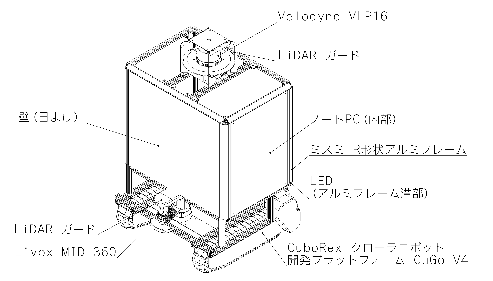
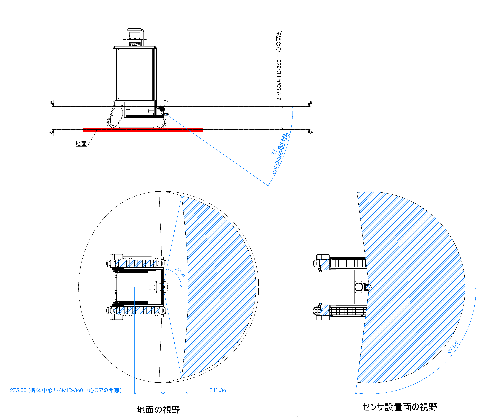
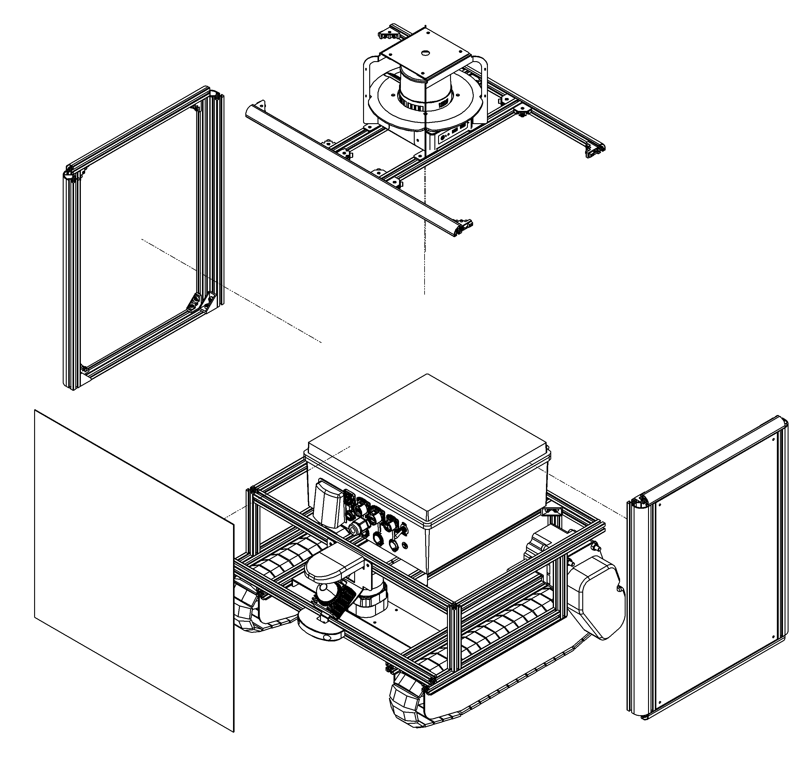

# 自律走行システムのハードウェア

自律走行を行う機体で必要な要素は大きく分けると下記5点となる．

- センサ
- 走行装置
- 計算機
- バッテリー
- シャーシ

センサは，自己位置推定や障害物を検出する為に必要となる．自己位置推定にはLiDARが多く使用されるが，GNSS，カメラといったセンサも使用される．
走行装置は，ロボットの移動の為に必要となる．ロボットではモータで車輪を駆動する形式が一般的だが，不整地走行に適したクローラ，段差や階段にも対応できる脚といった機構も使用される．
計算機は，センサから取得された情報から走行装置への指令を算出する為に必要となる．大量の計算が必要となる自己位置推定には概ねPCが使用される．多くのIOを要求されるモータ制御のため，マイコンも使用される．
バッテリーは，上記の機器を使用する為に必要な電力を供給ために必要となる．移動ロボットは消費電力低下のため，重量効率の高いLiPoバッテリーが多く使用される．
シャーシは，その他の機器を接続する為の機構物として必要となる．状況と要求されるタスクにより，適切にシャーシを作成する必要がある．

## 今回作成した機体

今回，自律走行を実現する基本的な構成を持ちつつ，不整地の走行も可能な機体とすることをコンセプトに，機体を作成した．
作成した機体とその搭載した機器を，図nに記載する．以降の章では，各要素について詳細を記載していく．

<!-- TODO: 図に追加する？バッテリー 制御ボックス -->

## センサ

自己位置推定を行うためのLiDARセンサとして，Velodyne社のVLP16を搭載した．
自己位置推定用のLiDARは，遠距離にある環境物(建物，樹木等)をセンシングすることで，自己位置を推定する．
通行人や障害物があった際にレーザー光を阻害し，自己位置推定の精度低下を発生させないために，機体の最上部に搭載した．
また，LiDARは光を使用したセンサであるため，光学窓に傷が発生すると誤検知が発生する．これを防ぐため，金蔵製のガードを作成した．
<!-- 文量が足りない場合，板金の向きについて書く -->

ロボットの自律走行を阻害する障害物を検出するLiDAR センサとして，Livox社のMID-360を搭載した．
自律走行用のLiDARは，遠距離をセンシングする必要がないため，機体の下部に設置した．
また，今回の機体は後進を行わないため，障害物の検出範囲は前方向のみとした．
障害物検出は，後述の通り地面の検出を実施するため，障害物検出範囲の地面も検出できる位置とした．
上記をみたす位置として，最終的な搭載位置は図nのような箇所とした．

<!-- ここから分量おおかったら削って良い個所 -->
LiDARを35°前傾させる事で，LiDAR取付位置から250mm先の地面を検出できる形とした．障害物の検出範囲は，機体進行方向から左右78°となった．
障害物検出用のLiDARも，光学窓への傷を防ぐ為，金属製のガードを上下に設置した．

## 走行装置

走行装置には，CuboRex社のクローラロボット開発プラットフォーム CuGo V4を使用した．不整地走行に適したクローラを有するプラットフォームを使用する事で，不整地の走破性向上と開発の高速化を図った．

## 計算機

<!-- TODO: PCの型番調べる -->
ロボットの制御を行うPCとして，○○社の○○を搭載した．
ノートPCを搭載することにより，ロボットを駆動する電源系列とPCを駆動する計算機の電源分割を実現した．
モータの制御には，CuboRex社製モータドライバを使用した．

<!-- 文量すくなかったらLD-2とらずピコの説明を書く -->

## バッテリー

<!-- TODO: バッテリー容量確認 -->
機体下部に，24V○○Ah のLiFePO4バッテリを搭載した．
本機体は不整地走行の可能性を考慮したため，路面により大きな振動が発生する可能性が考えられた．
想定を超える振動によるバッテリへの悪影響を考え，LiPoバッテリより安全性の高いLiFePO4バッテリーを採用した．
バッテリは機体下部に設置することで，重心の上昇による安定性の低下を防いだ．
バッテリから供給される電源は，ロボットに搭載した電源分配基板により適切に切替・分配・変圧し，PCを除く各機器に接続した．

## シャーシ

<!-- TODO: ロボットのいい感じの写真撮る -->
ロボットのシャーシは図nの形とした．

<!--  -->

屋外でのデバッグ作業を想定し，日よけの壁を搭載した．
ロボットは図nのような5ユニットで構成し，各部を計10本のボルトで分解できる形とした．

<!-- 文量すくなかったら書く -->
分解箇所には付当てを設置し，複数回の分割．組立を実施しても再現性のあるシャーシとなる形とした．

構造部材にはミスミ社 R形状アルミフレーム を使用することで，衝突しても対象に危害を加えにくい形状を実現した．
突起部・巻き込みが発生しうる箇所には，樹脂製のカバーを搭載した．

ロボットの状態表示のため，アルミフレームの溝部にLEDを搭載した．
これにより，ロボットが自律走行状態か，操作者による操作を実施している状態かを表示した．

<!-- あればLEDの詳細 -->
